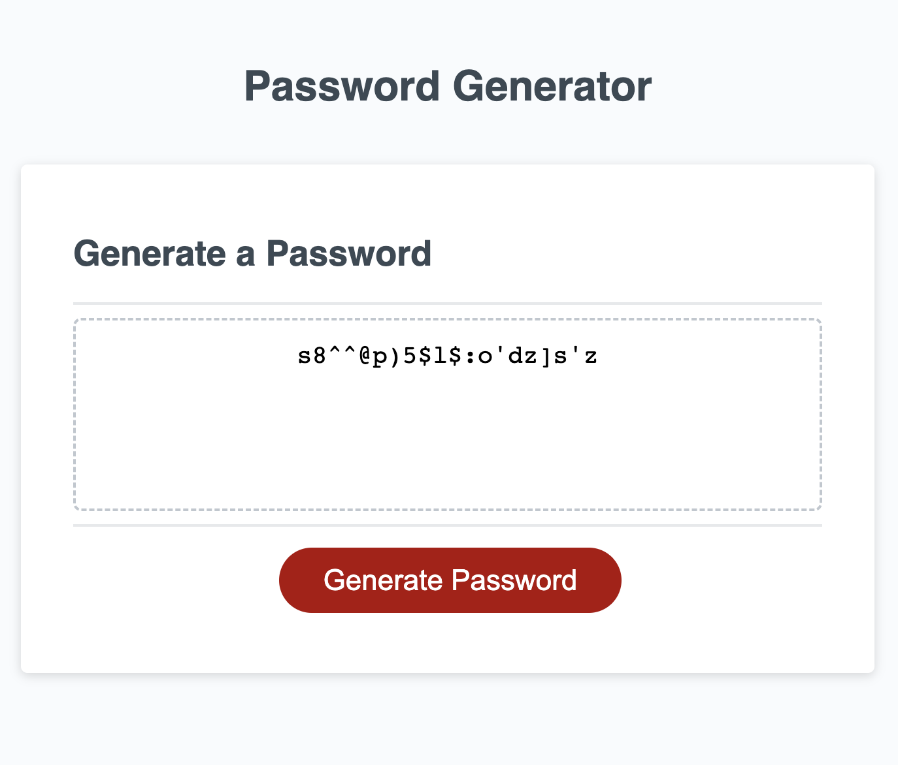

# Password-Generator
This application can generate a random password based on criteria users have selected.

## Description 
This project runs in the browser, with features dynamically updated via HTML, CSS and Javascript code. It has a clean and reponsive user interface. The 'Generate Password' button will trigger functions to request password options from users and then display a random password in the textarea with dashed border.

Here are the main features of the webpage.
* Present a series of prompts to request password criteria
    * Length of the password should be at least 10 but no more than 64.
    * At least one character type shoulbe be selected from 'lower case characters', 'upper case characters', 'numeric characters' and 'special characters'.
* The browser window will keep requesting information from users if the input isn't fit for the password criteria.
* The button should work properly to generate more than one passowrd.

## Deployment
Here is the screeshot of the deployed webpage.

Click the link to test my webpage: https://xiaozhao1111.github.io/Password-Generator/

## Contribution
Xiao Zhao, zhaoxiao20071106@gmail.com

## Community
It's open-source. Feel free to use it for learning purpose.